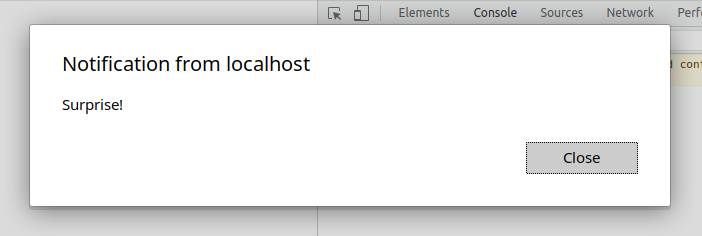

## Безопасная разработка в HTML/CSS и PHP

### I. Теоретическая часть.

В соответствии со статистикой [NST](https://nvd.nist.gov/vuln/search/statistics?form_type=Basic&results_type=statistics&query=php+xss&search_type=all&isCpeNameSearch=false) количество найденных уязвимостей XSS в приложениях, написанных на PHP составило:

в 2021 году - 378, или 1,88% от общего числа уязвимостей (20158)

в 2022 году - 367, или 1,46% от общего числа уязвимостей (25101)

Две новых уязвимости такого класса на 18 апреля 2023 года:

| Уязвимость                                                   | Дата публикации | Описание                                                     |
| ------------------------------------------------------------ | --------------- | ------------------------------------------------------------ |
| [CVE-2022-28353](https://nvd.nist.gov/vuln/detail/CVE-2022-28353) | 15.04.2023      | В плагине предупреждения о внешнем перенаправлении для [MyBB](https://mybb.com/) URL-адрес перенаправления (он же external.php?url=) уязвим для XSS. Служит для выдачи предупреждения перед переходом по внешним ссылкам |
| [CVE-2023-29847](https://nvd.nist.gov/vuln/detail/CVE-2023-29847) | 14.04.2023      | Было обнаружено, что AeroCMS v0.0.1 содержит множество уязвимостей для сохраненных межсайтовых сценариев (XSS) с помощью параметров comment_author и comment_content в /post.php . Эти уязвимости позволяют злоумышленникам выполнять произвольные веб-скрипты или HTML с помощью созданной полезной нагрузки. |

### II. Практическая часть.

Запустим тестовый стенд.

`docker pull ket9/otus-devsecops-xss:latest`
`docker run -d -p 8080:80 --name otus-05 -e tokentimetolive=6000 ket9/otus-devsecops-xss:latest`

#### Stored XSS

Вид атаки, когда результат достигается при открытии пользователем страницы, куда выводится информация, хранящаяся на сервере. Такой тип атаки не требует обязательной фишиноговой подготовки в отношении пользователей, так как вредоносный код доставляется на их машины при посещении зараженного сайта.

В исследуемом сервисе такой вариант атаки доступен через добавление комментария. Например, можно организовать вывод сообщения при каждом открытии страницы со списком комментариев, указав в качестве текста комментария при его добавлении текст:

`My first comment!`

Можно привести сервис в состояние отказа в обслуживании в части просмотра или добавления комментариев, или выполнить редирект на фишинговый сайт с таким-же дизайном:

``

В этом случае при открытии страницы с комментариями автоматически будет происходить редирект на указанную ссылку.

Могут быть случаи, когда подобного рода атака должна совершаться в отношении только одного или нескольких пользователей, а другие о ней знать не должны.  Доработав скрипт, мы получим его срабатывание только при наличии в адресной строке параметра **attack** со значением **true**:

``

Нужным пользователям может быть отправлена должным образом сформированная ссылка фишинговым письмом, а остальные про наличие такой проблемы даже не узнают:

`http://localhost:8080/XSS-1/index.php?attack=true`

#### Reflected XSS

Вид атаки, когда результат достигается после ввода пользователем вредоносного кода. Другое название - неперсистентный XSS, так как вредоносный код не хранится на сервере. Вариант использования такой атаки - фишинговое письмо со ссылкой, содержащей вредоносный код:

`get.php?search=;`

или через POST-запрос, например, в заранее подготовленной форме:

`form name=TheForm action=http://myapp.com/page.php method=post>`
   `<input type=hidden name=foo value=";"/>`
`</form>`

В исследуемом приложении такой вид атаки недоступен.

#### DOM-based XSS

Межсайтовые скрипты на основе DOM – это уязвимость, которая появляется в объектной модели документа, а не на HTML-страницах. В этом случае выполняется манипулирование компонентами объектной модели документа, без отправки вредоносного кода на сервер, что существенно усложняет обнаружение такой уязвимости.

Так как в чистом виде этот тип атаки в приложении недоступен, попробуем продемонстрировать его, используя дополнительно Stored XSS.

С помощью простого скрипта и правильно сформированных ссылок мы можем выполнять произвольный код на атакуемой машине:

Добавляем комментарий:

``

Формируем ссылку:

`http://localhost:8080/XSS-1/#alert('Surprise!')`

И получаем результат:

Особенностью DOM-based атак является то, что они выполняются исключительно на стороне клиента. Это достигается за счет использования символа **#** в ссылке, так как все что находится после него отрезается и на сервер не передается, но доступно в JavaScript на клиенте. То есть в нашем случае для выполнения любоых операций, на которые способен JavaScript, нам достаточно только 1 зараженного комментария.

#### Blind XSS

Подвид Stored XSS, только ориентирован на отложенное срабатывание, и вообще не обязательно в этом приложении. Зачастую используется для атаки на административные панели сервисов.

#### Self XSS

Вид атаки, когда пользователь самостоятельно запускает вредоносный код, например в консоли браузера. 

#### mXSS (mutation-based XSS)

Относительно новый и достаточно опасный вектор атак. Заключается в том, что безопасный с точки зрения HTML-санитайзеров пользовательского ввода скрипт, после его обработки превращается во вредоносный. 

Примеры атаки с использованием этого метода для [Firefox](https://portswigger-labs.net/mxss/?input=%3Cmath%3E%3Cmtext%3E%3Ctable%3E%3Cmglyph%3E%3Cstyle%3E%3C![CDATA[%3C/style%3E%3Cimg%20title=%22]]%26gt;%26lt;/mglyph%26gt;%26lt;img%26Tab;src=1%26Tab;onerror=alert(1)%26gt;%22%3E) и [Chrome-based](https://portswigger-labs.net/mxss/?input=%3Cmath%3E%3Cmtext%3E%3Ctable%3E%3Cmglyph%3E%3Cstyle%3E%3C!--%3C/style%3E%3Cimg%20title=%22--%26gt;%26lt;img%20src=1%20onerror=alert(1)%26gt;%22%3E) браузеров.

### Основные технические способы противодействия XSS-атакам.

Экранирование входных и выходных данных, по возможности избегая самописных решений - лучше использовать или штатные средства языка, или популярные проверенные библиотеки (например, для PHP это Reform или HTML Purifier), отсекая HTML-теги и другие потенциально опасные данные.

Валидация пользовательского ввода.

Использование HTML-санитайзеров.

Установка для cookies, содержащих чуствительные данные флага **httpOnly** - тогда они не будут доступны для чтения через JavaScript.

Явно указывать кодировку страницы, чтобы избежать проблем с экранированием символов **<** и **>**, если они указаны в кодировке **UTF-7** (тогда они имеют вид **+ADw-** и **+AD4-** и скорее всего будут пропущены при валидации или экранировании, а с ними и весь вредоносный скрипт).

Использовать заголовок **Content Security Policy**. Это заголовок, который позволяет в явном виде объявить «белый список» источников, с которых можно подгружать различные данные, например, JS, CSS, изображения и пр. Даже если злоумышленнику удастся внедрить скрипт в веб-страницу, он не выполниться, если не будет соответствовать разрешенному списку источников (при условии внедрения через **script src=...**)

Регулярный анализ новых обнаруженных уязвимостей и обновление зависимостей проекта на версии, в которых обнаруженные уязвимости устранены.
