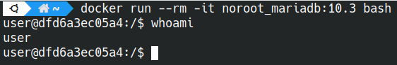

## Обеспечение безопасности в Docker контейнерах

### Часть I

Использование в качестве базового образа alpine позволяет сократить вектор атак. Однако в исследовательских целях будем использовать образ, который с высокой долей вероятности содержит ряд проблем безопасности.

Все эксперименты в рамках задания будем выполнять с образом СУБД MariaDB. Для начала выполним его скачивание из [docker hub](https://hub.docker.com/):

```
docker pull mariadb:10.3  
```


Посмотрим список образов, которые есть на данный момент (на скриншоте скрыты некоторые служебные образы):

```
docker image ls
```


Посмотрим, отличаются ли пользователи хоста и образа. Для этого выполним последовательно команду `whoami` сначала на хостовой машине, потом - в запущенном образе. 

```bash
whoami
docker run --rm -it mariadb:10.3 bash
whoami
```

Результат выполнения указанных выше команд представлен на скрине. Мы видим, что на хостовой машине текущим пользователем является **sergey**, а в контейнере - **root**.


### Часть II

Запуск приложений в контейнере от пользователя root небезопасен, поэтому переделаем контейнер, чтобы все работало от непривилигерованного пользователя.

Сделаем новый образ на основе ранее скачанного, добавив в него нового пользователя:

```dockerfile
 FROM mariadb:10.3
 RUN useradd -rm -d /home/user -s /bin/bash -g users -u 1001 user
 USER user
```

Запустим сборку:

```bash
docker build . -f Dockerfile_noroot -t noroot_mariadb:10.3
[+] Building 0.0s (6/6) FINISHED
 => [internal] load .dockerignore
 => => transferring context: 42B
 => [internal] load build definition from Dockerfile_noroot
 => => transferring dockerfile: 140B
 => [internal] load metadata for docker.io/library/mariadb:10.3
 => [1/2] FROM docker.io/library/mariadb:10.3
 => CACHED [2/2] RUN useradd -rm -d /home/user -s /bin/bash -g users -u 1001 user
 => exporting to image
 => => exporting layers
 => => writing image sha256:67ac3a852d3996b552e15431bea1d8dea8ded4f7d01a490ee39513f41ff83dad
 => => naming to docker.io/library/test
```

Посмотрим на информацию о собранном образе:

```bash
docker image inspect noroot_mariadb:10.3
...
[
    {
        "Id": "sha256:67ac3a852d3996b552e15431bea1d8dea8ded4f7d01a490ee39513f41ff83dad",
        "RepoTags": [
            "noroot_mariadb:10.3",
            "noroot_mariadb:latest",
            "test:latest"
        ],
        "RepoDigests": [],
        "Parent": "",
        "Comment": "buildkit.dockerfile.v0",
        "Created": "2023-06-05T22:25:57.287381789+03:00",
        "Container": "",
        "ContainerConfig": {
            "Hostname": "",
            "Domainname": "",
            "User": "",
            "AttachStdin": false,
            "AttachStdout": false,
            "AttachStderr": false,
            "Tty": false,
            "OpenStdin": false,
            "StdinOnce": false,
            "Env": null,
            "Cmd": null,
            "Image": "",
            "Volumes": null,
            "WorkingDir": "",
            "Entrypoint": null,
            "OnBuild": null,
            "Labels": null
        },
        "DockerVersion": "",
        "Author": "",
        "Config": {
            "Hostname": "",
            "Domainname": "",
            "User": "user",
            "AttachStdin": false,
            "AttachStdout": false,
            "AttachStderr": false,
            "ExposedPorts": {
                "3306/tcp": {}
            },
            "Tty": false,
            "OpenStdin": false,
            "StdinOnce": false,
            "Env": [
                "PATH=/usr/local/sbin:/usr/local/bin:/usr/sbin:/usr/bin:/sbin:/bin",
                "GOSU_VERSION=1.14",
                "LANG=C.UTF-8",
                "MARIADB_MAJOR=10.3",
                "MARIADB_VERSION=1:10.3.39+maria~ubu2004"
            ],
            "Cmd": [
                "mysqld"
            ],
            "Image": "",
            "Volumes": {
                "/var/lib/mysql": {}
            },
            "WorkingDir": "",
            "Entrypoint": [
                "docker-entrypoint.sh"
            ],
            "OnBuild": null,
            "Labels": {
                "org.opencontainers.image.authors": "MariaDB Community",
                "org.opencontainers.image.base.name": "docker.io/library/ubuntu:focal",
                "org.opencontainers.image.description": "MariaDB Database for relational SQL",
                "org.opencontainers.image.documentation": "https://hub.docker.com/_/mariadb/",
                "org.opencontainers.image.licenses": "GPL-2.0",
                "org.opencontainers.image.ref.name": "ubuntu",
                "org.opencontainers.image.source": "https://github.com/MariaDB/mariadb-docker",
                "org.opencontainers.image.title": "MariaDB Database",
                "org.opencontainers.image.url": "https://github.com/MariaDB/mariadb-docker",
                "org.opencontainers.image.vendor": "MariaDB Community",
                "org.opencontainers.image.version": "10.3.39"
            }
        },
        "Architecture": "amd64",
        "Os": "linux",
        "Size": 368986021,
        "VirtualSize": 368986021,
        "GraphDriver": {
            "Data": null,
            "Name": "btrfs"
        },
        "RootFS": {
            "Type": "layers",
            "Layers": [
                "sha256:6f37ca73c74f2cef0ddefd960260f2033c16c84583c5507a4f37b1cf7631dc20",
                "sha256:e5e0f54fc85f7dd4bb1311ea35493d640d9719c2facc78564a3c2eaae0ebc462",
                "sha256:37bfcf898d29568e1c80fb5c8d968e360f8bb544f4f0147e7b7b6daa6e6a9227",
                "sha256:b03ce6585035a7adcce2a273ac32c43e38ab714d791e5e1a67078c836ccc375b",
                "sha256:7adde0ac1571c0a0bc16de519be4ac9f06d563ac9b90658fdc35c004610da73d",
                "sha256:063dafa1afa3dcbfc721e48ae8c926964410315757777f8b57560ddbfb538487",
                "sha256:b45260616e681ab8dad93486007cbff832c5d0021671e14c878319a5a73540be",
                "sha256:f7ef09ddb028f484009e3208d2b0af5327b8cb31fcf7b48236b39cbd2b71cc9e",
                "sha256:f18a6d6529106993619343239e7dc58e5c0e8afb6d2fa86554aad2a8a6301414",
                "sha256:5bcf68715e1a0cb1d673e6d9cfec5753d76a014f32915538e8b9339f057e0cb9"
            ]
        },
        "Metadata": {
            "LastTagTime": "2023-06-06T14:49:12.616568709+03:00"
        }
    }
]
```

Теперь запустим новый контейнер на основе собранного образа, и убедимся, что теперь используется непривилегированный пользователь:

```bash
docker run --rm -it noroot_mariadb:latest bash
```



**Дополнительные параметры безопасности Docker.**

Рассмотрим некоторые дополнительные меры безопасности при работе с контейнерами.

**Обновление зависимостей при сборке**

Так как базовый образ, который мы используем, может не обновляться в течение длительного времени, мы можем получить ряд неисправленных в нем уязвимостей, которые уже были устранены в более новых версиях пакетов. Чтобы получать все обновления, в том числе связанные с безопасностью, следует выполнить его при сборке образа. Для этого исправим наш Dockerfile:

```dockerfile
FROM mariadb:10.3
RUN apt-get update && apt-get upgrade -y && rm -rf /var/lib/apt/lists && useradd -rm -d /home/user -s /bin/bash -g users -u 1001 user
USER user
```

**Файл .dockerignore**

При сборке образа с помощью команды `docker build` передается так называемый контекст сборки - папка с файлами, которые необходимы для сборки образа. 

По умолчанию, для сборки будут переданы все файлы, которые находятся в указанной папке, и без контроля контекста может возникнуть ряд проблем, если в Dockerfile используются команды `ADD .` или `COPY .`:

- увеличение размера итогового образа
- раскрытие чувствительных данных, если они находятся в файлах в указанной папке
- инвалидация кэша при сборке, что может привести к увеличению ее времени.

Для контроля контекста необходимо использовать специальный файл **.dockerignore**. С его помощью можно определить, что входит в контекст сборки, а что нет. Например, можно игнорировать все файлы markdown (md), кроме всех файлов README*.md, исключая README-secret.md:

```
*.md
!README*.md
README-secret.md
```

**Теги образов.**

При использовании образов следует избегать тега **latest**, заменив его конкретным тегом нужной версии образа. 

Общая причина, которой следует избегать этого тега заключается в том, что Docker будет использовать локальную копию образа с указанным тегом, не проверяя Docker Hub или другой репозиторий на наличие его обновлений при запуске контейнера. 

Рассмотрим гипотетическую ситуацию.

На машине А уже имеется образ с тегом mariadb:latest, внутри которого находится MariaDB версии 8.0.

Через некоторое время на  машину B тоже скачивается образ с тегом mariadb:latest, но так как уже вышла новая версия, то этот образ будет содержать MariaDB версии 9.0

Таким образом мы получаем, что два образа с одинаковым тегом принесли нам в систему разные версии СУБД, что может вызвать ряд проблем, если на всех машинах принудительно не обновить этот образ для получения новой версии, или если мы зависим от конкретной версии MariaDB.

**Безопасность docker daemon**

По умолчанию демон Docker использует **User namespace** хоста. Следовательно, любое успешное повышение привилегий внутри контейнера будет также означать получение root-доступа как к хосту, так и к другим контейнерам.

Чтобы снизить этот риск, необходимо настроить хост и демон Docker на использование отдельного пространства имен с помощью параметра --userns-remap или указав эту настройку в файле конфигурации демона.

**Переменные окружения**

Не стоит передавать в сборку чувствительные данные через параметры ARG/ENV при сборке образа - они останутся в нем и будут доступны.

Если есть такая необходимость - стоит использовать  [BuildKit](https://docs.docker.com/build/buildkit/) (доступно только с версии 23.0).

**Защита сокета демона Docker**

Демон Docker использует сокет /var/run/docker.sock для входящих соединений API. Владельцем данного ресурса должен быть только пользователь root. Изменение прав доступа к этому сокету по сути равносильно предоставлению root-доступа к хостовой системе.

Также не следует шарить сокет /var/run/docker.sock с контейнерами, там где без этого можно обойтись, поскольку в таком случае компрометация сервиса в контейнере приведет к полному контролю над хостовой системой.

**Привилегии и возможности.**

Привилегированные контейнеры (запущенные с флагом --privileged) часто используются, когда для выполнения задач нужен прямой доступ к аппаратной составляющей. Однако привилегированные Docker-контейнеры могут позволить злоумышленникам захватить хост-систему.

Вместо того, чтобы предоставлять контейнерам полный доступ к хост-системе, следует предоставить только те полномочия, которые им нужны, указав необходимые параметры при запуске контейнера.

Например, вместо предоставления контейнеру полного доступа, можем оставить ему NET_BIND_SERVICE, если ему нужно соединяться с портом ниже 1024:

```bash
docker run ... --cap-drop=all --cap-add NET_BIND_SERVICE ...
```

Также при запуске контейнера полезно использовать флаг **--security-opt=no-new-privileges** который предотвращает повышение привилегий внутри контейнера.

**Ресурсы**

Во избежание излишней утилизации ресурсов контейнером стоит ограничивать их использование. Мы можем ограничить использование памяти, CPU, а также установить количество перезапусков контейнера в случае сбоя, чтобы это не происходило бесконечно:

```bash
docker run ... --memory="400m" --memory-swap="1g" --cpus=0.5 --restart=on-failure:5 ...
```

**Файловая система**

Если контейнеру нет необходимости что-либо писать, то стоит использовать read-only файловую систему:

```bash
docker run ... --read-only ...
...
docker run -v volume-name:/path/in/container:ro ...
```

**Сети**

По умолчанию в Docker включено межконтейнерное взаимодействие, это означает, что все контейнеры могут взаимодействовать между собой (используя сеть docker0). Эта возможность может быть отключена путём запуска Docker сервиса с флагом —icc=false, или путем создания отдельных сетей для каждого контейнера и их группы:

```bash
docker network create <network_name>
docker run --network=<network_name>
```

### Часть III

Помимо выполнения ранее указанных рекомендаций, для обеспечения должного уровня безопасности контейнеров следует использовать специализированные инструменты. Рассмотрим некоторые из них.

**[Docker Bench for Security](https://github.com/docker/docker-bench-security)**

По сути это набор bash скриптов для проверки безопасности конфигурации образа, контейнера и хоста, покрывающий сразу несколько областей.

- Конфигурация хоста
- Конфигурация Docker daemon;
- Проверка конфигурационных файлов Docker daemon;
- Проверка образов контейнеров и build-файлов;
- Runtime проверки (AppArmor, SELinux расширения, политика перезапусков, открытые порты и используемые разделяемые пространства имен);
- Общая работа с образами (сколько контейнеров/образов имеется и сколько реально используется);
- Конфигурация Docker Swarm (настройки менеджеров контейнеров, управление секретами на них, отделение трафика между контейнерами от трафика между менеджерами).

[Пример отчета](./reports/docker-bench-security-report.txt)

**[Trivy](https://github.com/knqyf263/trivy)**

Trivy находит уязвимости двух типов – проблемы сборок ОС (поддерживаются Alpine, RedHat (EL), CentOS, Debian GNU, Ubuntu) и проблемы в зависимостях (Gemfile.lock, Pipfile.lock, composer.lock, package-lock.json, yarn.lock, Cargo.lock)

[Пример отчета](./reports/trivy_report.txt) по проверке созданного в рамках задания образа:

```bash
trivy image noroot_mariadb:latest
```

Мы видим, что был найден ряд уязвимостей, включая довольно свежие, до уровня HIGH, что говорит нам о необходимости выполнить обновление этого образа (при его наличии) или подумать о переходе на другую версию:


